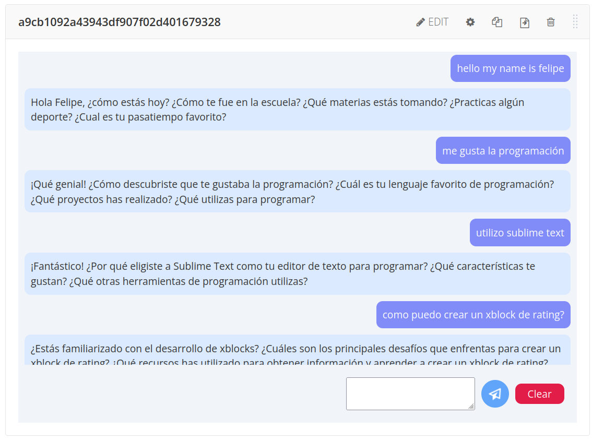

OpenAI XBlock
#############################

Purpose
*******

This project is a hackathon attempt at connecting xblocks with the OpenAI API.

The xblock creates a chat with some pre-conditions that make OpenAI chat with a student that is learning a new language.

Example
*******

Testing with Docker
********************

This XBlock comes with a Docker test environment ready to build, based on the xblock-sdk workbench. To build and run it::

    $ make dev.run

The XBlock SDK Workbench, including this XBlock, will be available on the list of XBlocks at http://localhost:8000
